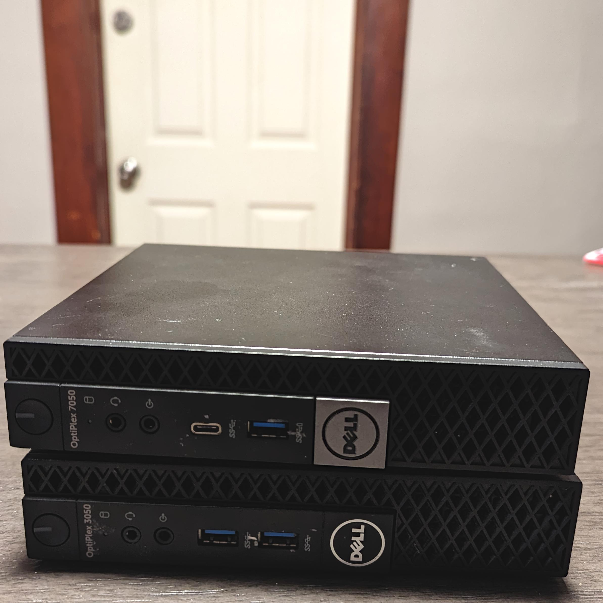
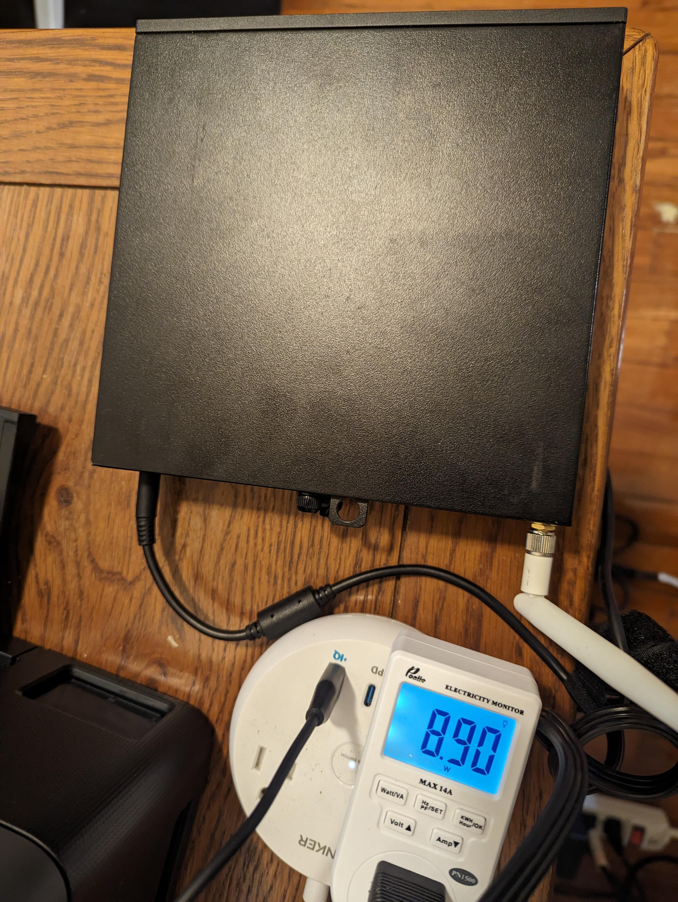

I wanted to create an offsite server to host some backups and potentially run some services. This is
a half blog post and half tutorial. I'll try to capture the steps needed to recreate it, but by no
means am I saying this is the best way to create or setup such a server.

# Requirements

1. Low cost < $200
    - I don't want to spend a ton of money on this thing. And I don't need a ton of storage. So I
      think $200 is a reasonable budget as long as some of the components are used.
2. Small footprint
    - I'm hoping for this server to be hosted by either a friend of family member, it must be small
      enough for them to accept my proposal.
3. Low power
    - Again, for the same reason the server should have a minimal impact on my hosts power bill.
4. At least 2TB of space.
    - I currently don't have a ton of data that I care about. Mainly just my next cloud instance and
      config files for the services I run on my local server.
5. An easy, robust method of remote access.

# The Hardware

Before we get into it, I must confess: I have a small addiction to used Dell machines. My main
server for the past 5 years has been an old Dell Optiplex tower and my current router is a small
form factor Dell Inspiron.

Enter the **Dell Optiplex 3050 Micro**.



It's nothing special, but can be picked up for relatively cheap and meets all my hardware
requirements. I spent $192 for 3 shipped to me off of ebay ($64 a piece). It has a quad core
i5-7500, 8GB RAM, and a 256GB NVMe boot drive. Really not bad for < $70.

The major downside is that it only has a single 2.5" drive slot. While not a limitation in my
instance, it may be for those looking for larger storage or redundant drives.

SATA SSDs have gotten surprisingly cheap even compared to 2.5" hard drives. So I picked up a
Teamgroup AX2 2TB for $84. Not an amazing deal, but 2TB 2.5" hard drives cost ~$70. So, I'll take
the cost hit to upgrade to an SSD.

This brings my total cost to **$147**.

Plus at idle this thing draws < 10 Watts!



# The software

## OS

I decided to try out CentOS Stream for this build. Mainly for it having a long support life and
rolling release. I normally run Ubuntu on my servers, but wanted to try a rolling distro to
hopefully avoid many problems occurring at once when doing OS upgrades. I'd love to hear your
thoughts on good OSes for servers.

## Filesystem

My primary server runs ZFS and I love all the features it provides. Things like encryption,
snapshots, and block level checksums. It's also fairly easy to import onto another machine. I've
plugged in half of a ZFS array and had it mounted in minutes.

So, I decided that my storage drive here would also be ZFS. This way I can easily perform
incremental backups using `zfs send`.

## Remote Access

For simplicity, I decided my remote access should be managed with SSH. I'll be using one of Oracle's
free tier cloud machines as my jump box. I also setup a domain to point to it's IP. While I used a
cloud server, you could also expose a port on your local network and NAT forward it to a server you
own. The main thing is that you have a publicly available SSH server.

> **Note:** I'd recommend on all publicly available SSH servers you disable password authentication.
> This will make brute force attacks much more difficult. This can be achieved by adding the
> `PasswordAuthentication no` line to `/etc/ssh/sshd_config`.

The high level picture here is the offsite machine will forward it's SSH port to the public server.
Then to access the offsite server, you will proxy jump through the public server.

I have a few recommended setup steps on your public SSH server to make sure that you will have
access to your offsite server even if something happens to your public server. These should make
your system very robust and allow for easy remote recovery even in catastrophic circumstances.

1. Give your server a domain name. You will use this to connect to the server instead of the IP. So
   that in case your IP ever changes, you can simply change the DNS record.
2. Backup the host keys of the public machine. This way if you need to "hot swap" the public server,
   you can copy the host keys to a new server and it will have the same fingerprint as the old one.
    - Ensure you keep these in a secure place (ideally encrypted) since these are the private keys
      on your server.

### Reverse SSH Service

On your offsite server create an SSH key for the root user:

```bash
sudo ssh-keygen -t ecdsa
```

Create a new file at `/etc/systemd/system/ssh-reverse.service`. And copy the contents below. Be sure
to update the domain, key path, and user on the ssh command.

```ini
[Unit]
Description=Reverse SSH connection
After=network.target

[Service]
User=root
Type=simple
ExecStart=/usr/bin/ssh -vvv -g -N -T -o "ServerAliveInterval 10" -o "ExitOnForwardFailure yes" -R 22221:localhost:22 -i /root/.ssh/id_ecdsa user@ssh.example.com
Restart=always
RestartSec=5s

[Install]
WantedBy=default.target
```

Start the service `sudo systemctl enable ssh-reverse && sudo systemctl start ssh-reverse`. If you're
using a redhat based distro like me, you might need to play with selinux settings since it is likely
blocking ssh from running.

Now SSH to your public server and verify you can access your offsite server. Once connected you
should be able to run the following command and get a response.

```bash
ssh offsiteUsername@localhost -p 22221
```

Now, anytime your offsite machine gets an internet connection, it will connect to your public server
and you will be able to access it.

#### Explanation

We're setting our reverse SSH command up as a systemd service so it will automatically run and
restart.

Really the only important part of that ssh command is `-R 22221:localhost:22`. This tells SSH to
forward all traffic on port 22221 on the public server to `localhost:22` on this machine. Note that
by default the remote server will only listen on it's localhost. If you want to make the port
publicly available you can add a bind address like this: `0.0.0.0:22221:localhost:22`. However you
will need to set the `GatewayPorts` option on the public server's sshd config.

### Client configuration

Now moving on to the machine you want to access the offsite server from.

We'll be using SSH's `ProxyJump` feature. Basically this will let you SSH to a proxy server then SSH
to your destination from there. In our case we'll be using the public SSH server for this.

You need to add the following to your `~/.ssh/config`.

```conf
Host offsite
	HostName localhost
	Port 22221
	User offsiteuser
	Proxyjump publicserver
	IdentityFile ~/.ssh/id_ecdsa
```
